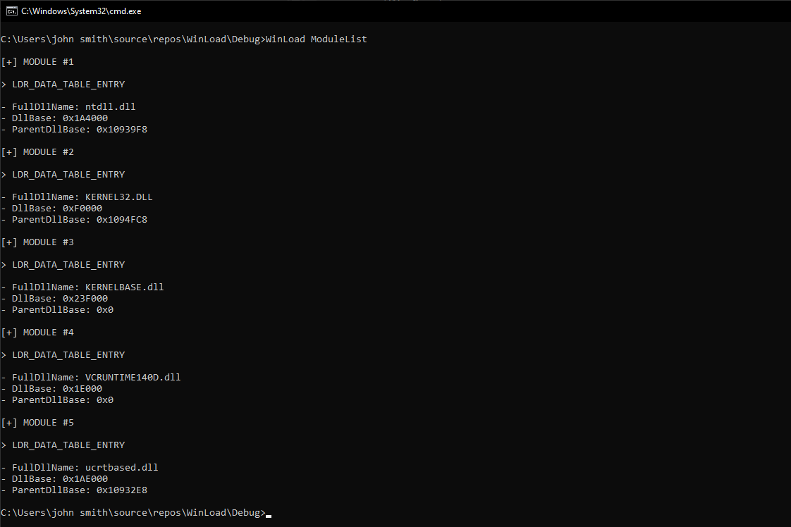
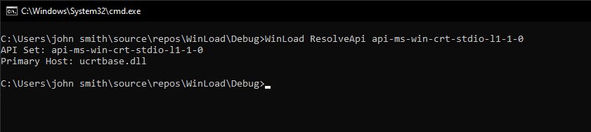

# WinLoad

- Detailing undocumented functionality from the Windows 10 image loader
- Currently targeting the x86 image loader.

# Screenshots

# Credits

- [Geoffchappell.com](https://www.geoffchappell.com) helpful in understanding and reversing undocumented or partially documented Windows structures.
